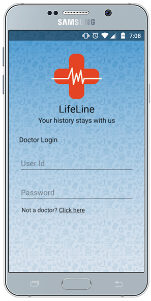
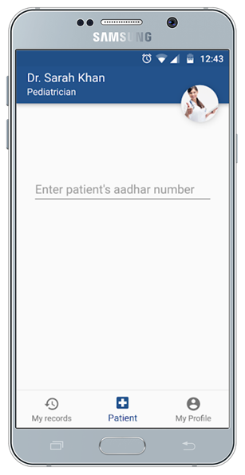
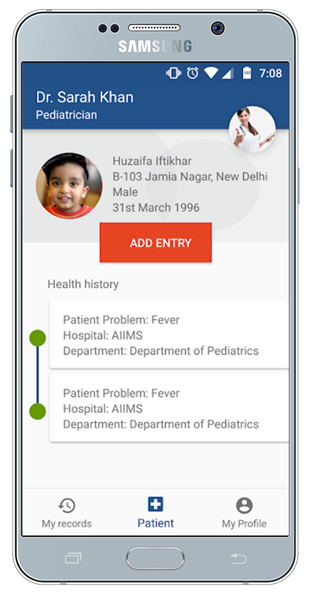
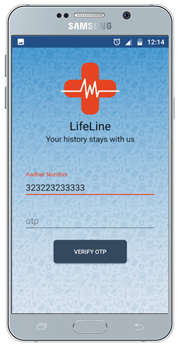
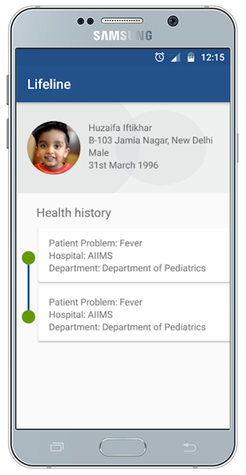
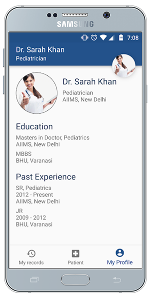

# Lifeline
A prototype of Universal Healthcare System developed during HACK-JMI Hackathon on 24th March 2018 organised by  IEEE-JMI during Encomium Technical Fest. Awarded 2nd prize.

## Screenshots

## Watch the video
